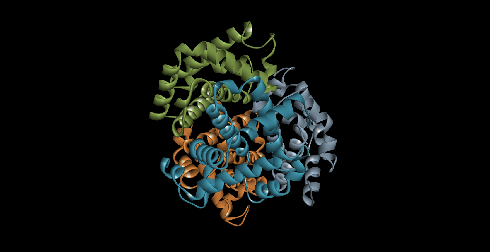

для начала нужно установить Discovery Studio 2021 Client  
И открыть в нем интересующий нас белок. Делается это через стандартаное CTRL+o  

После этого модифицировать визуализацию белка можно следующий образом:  

Это диалоговое окно вызывается комбинацией клавишь CTRL+D  
Для первого задания достаточо выбрать правильный стиль и вкладку(Atom, Protein)  
Для второго, помимо правильного стиля, в этом же диалоговом окне нужно выбрать правильное значение вкладки color by

Теперь можно перейти к выполнению задания. Визуализируем структкуру в виде:  

Wireframe:
  

backbone:

spacefill:

ribbons:

molecular surface:

Теперь чуть сложнее, раскрасим структуры:

цветовой моделью CPK:

Различными цветами по доменам белка:

ну и белок публикационного качества (на самом деле тулза генерит все в классном качестве, так что я просто натыкал самый завораживающий вариант)
